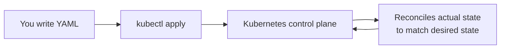

# Introduction & Your Cluster

👋 Welcome to **Kubernetes 101**! You already know how to build and run containers with Docker. Kubernetes is what you reach for when one container on one machine isn't enough — when you need to keep your app running, scale it, update it without downtime, and expose it to the world.

By the end of this lab you will have deployed a real application to a real Kubernetes cluster and learned the core building blocks:

- 📦 **Pods** — how Kubernetes runs your containers
- 🚀 **Deployments** — keeping your app healthy and self-healing
- 🔌 **Services** — stable networking and load balancing
- 📈 **Scaling & rolling updates** — growing and upgrading with zero downtime
- 🌐 **Ingress** — exposing your app at a real URL

> [!NOTE]
> The same Kubernetes you'll use here is the one built into **Docker Desktop**. Everything you learn transfers directly to the cluster on your own machine — and to production clusters in the cloud.

## 🎁 The cluster you've been given

There's no cluster setup to do. This labspace already includes a fully running **k3s** cluster (a lightweight, certified Kubernetes distribution) right beside your terminal, with `kubectl` pre-configured to talk to it.

`kubectl` is the command-line tool you use to talk to any Kubernetes cluster. Let's confirm everything is alive.

1. Ask the cluster for its nodes — the machines that run your workloads:

    ```bash
    kubectl get nodes
    ```

    You should see one node with a `STATUS` of `Ready`. That single node is your whole cluster for this lab.

2. Look at the pods already running across **all** namespaces. These keep Kubernetes itself working:

    ```bash
    kubectl get pods -A
    ```

    You'll see system components like CoreDNS (cluster DNS) and Traefik (the ingress controller you'll use in the last section).

3. Get a one-line summary of the cluster:

    ```bash
    kubectl cluster-info
    ```

> [!TIP]
> Typing `kubectl` all day gets old. A short `k` alias is pre-configured, so `k get nodes` works too. This lab spells out `kubectl` for clarity, but use whichever you prefer.

## 🗺️ How you'll talk to Kubernetes

Kubernetes is **declarative**. Instead of running imperative commands like `docker run`, you describe the *desired state* of your system in YAML files, hand them to the cluster, and Kubernetes works continuously to make reality match your description.



That reconciliation loop is the heart of Kubernetes — and the reason your app heals itself when things go wrong. You'll see it in action very soon.

When `kubectl get nodes` shows a `Ready` node, you're ready. Head to the next section to run your first Pod. 🚀
