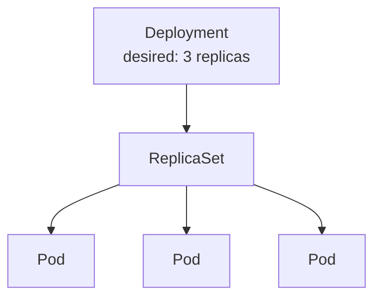

# Deployments

You just saw that a bare Pod, once deleted, stays gone. A **Deployment** fixes that. You tell it "I want 3 copies of this Pod running at all times," and it relentlessly makes that true — restarting crashed pods, replacing ones on failed nodes, and keeping the count exactly where you asked.

Under the hood, a Deployment manages a **ReplicaSet**, which in turn manages the Pods:



## 🚀 Create a Deployment

Open :fileLink[k8s/deployment.yaml]{path="k8s/deployment.yaml"}. Notice three important parts:

- `replicas: 3` — the desired number of Pods
- `selector` — how the Deployment knows which Pods belong to it (by the label `app: web`)
- `template` — the Pod blueprint it stamps out, including a `readinessProbe` so Kubernetes only sends traffic to pods that are actually ready

1. Apply the Deployment:

    ```bash
    kubectl apply -f k8s/deployment.yaml
    ```

2. Watch the pods appear. Run this a few times until all 3 are `Running` and `READY 1/1`:

    ```bash
    kubectl get pods
    ```

    Notice the pod names now have random suffixes like `web-7d9c8b6f5-abc12` — the Deployment generated them for you.

3. See the Deployment's own view of the world:

    ```bash
    kubectl get deployment web
    ```

    `READY 3/3` means desired state matches actual state. 

4. Peek at the ReplicaSet the Deployment created to manage those pods:

    ```bash
    kubectl get replicaset
    ```

## 🩹 Watch it heal itself

This is the magic moment. Delete a pod and watch Kubernetes notice and replace it — instantly.

1. Delete exactly one pod (this command grabs the name of the first one for you):

    ```bash
    kubectl delete pod $(kubectl get pods -l app=web -o jsonpath='{.items[0].metadata.name}')
    ```

    > [!TIP]
    > You can also copy a specific pod name from `kubectl get pods` and run `kubectl delete pod <name>` yourself.

2. Immediately list the pods again:

    ```bash
    kubectl get pods
    ```

    You'll still see **3** pods — one is brand new (check its `AGE`), already replacing the one you deleted. The Deployment's reconciliation loop noticed the count dropped to 2 and created a replacement to get back to 3. You never told it to; it just *does* that. 🩹

## 🧠 The big idea

You declared a desired state ("3 healthy pods running this image") and Kubernetes takes ongoing responsibility for keeping it true. This is what makes Kubernetes resilient — and it's why you'll almost never create bare Pods in real life.

But there's a catch: those 3 pods each have their own IP, and those IPs change every time a pod is replaced. How does anything reliably *reach* your app? That's the job of a **Service** — up next. 🔌
