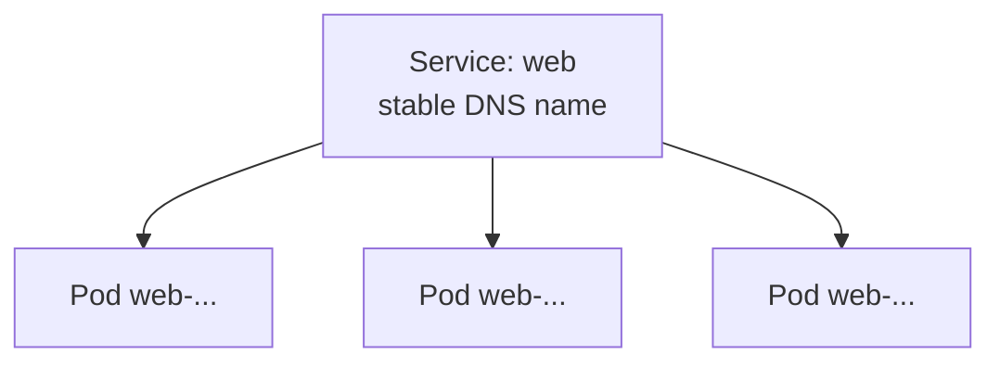

# Services

Your Deployment runs 3 pods, but each has its own IP address that changes whenever a pod is replaced. You can't hard-code an address that keeps moving. A **Service** solves this by giving your set of pods **one stable name and address**, and it **load-balances** requests across all the healthy pods behind it.



The Service finds its pods using the **same label** the Deployment stamped on them: `app: web`. Labels are the glue that connects Kubernetes objects together.

## 🔌 Create a Service

Open :fileLink[k8s/service.yaml]{path="k8s/service.yaml"}. Note:

- `selector: app: web` — which pods this Service sends traffic to
- `port: 80` — the port the Service listens on inside the cluster
- `targetPort: 3000` — the port your app listens on inside each pod

1. Apply the Service:

    ```bash
    kubectl apply -f k8s/service.yaml
    ```

2. Look at it. The default type is `ClusterIP` — reachable from **inside** the cluster:

    ```bash
    kubectl get service web
    ```

3. Confirm it found your pods. The endpoints list should show 3 pod IPs:

    ```bash
    kubectl get endpoints web
    ```

    Three endpoints means the Service successfully matched all three pods via the `app: web` label. ✅

## ⚖️ Watch the load balancing

Inside the cluster, the Service is reachable by its name (`web`) thanks to cluster DNS. Let's send it several requests and watch them get spread across different pods.

You'll launch a tiny throwaway pod that makes 6 requests to the Service and then deletes itself:

```bash
kubectl run client --rm -i --restart=Never --image=busybox -- \
  sh -c 'for i in $(seq 1 6); do wget -qO- http://web/api; done'
```

Look at the `pod` field in the responses — you'll see **different pod names** as the Service distributes your requests across all three replicas:

```json no-copy-button
{"version":"1.0","pod":"web-7d9c8b6f5-abc12"}
{"version":"1.0","pod":"web-7d9c8b6f5-xy789"}
{"version":"1.0","pod":"web-7d9c8b6f5-abc12"}
{"version":"1.0","pod":"web-7d9c8b6f5-qr456"}
...
```

> [!NOTE]
> The client reached your app at simply `http://web/` — no IP addresses, no hard-coded pod names. That stable name is the whole point of a Service. As pods come and go, the name keeps working.

## 🧠 The big idea

- **Pods** are disposable and have changing IPs.
- A **Service** gives a group of pods one durable address and load-balances across them.
- **Labels and selectors** are how Kubernetes wires objects to each other.

Your app is now reliably reachable *inside* the cluster. Next you'll make it more powerful — scaling it up and rolling out a new version without dropping a single request. 📈
