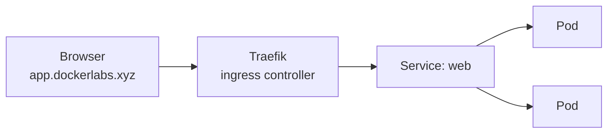

# Exposing Your App with Ingress

Your `ClusterIP` Service is only reachable from inside the cluster. To let real users reach your app through a normal URL, you need an **Ingress** — a rule that tells the cluster's ingress controller how to route outside HTTP traffic to your Service.

This cluster runs **Traefik** as its ingress controller (you saw it back in section 1). An Ingress resource is how you ask Traefik: *"send requests for this hostname to this Service."*



## 🌐 Create the Ingress

Open :fileLink[k8s/ingress.yaml]{path="k8s/ingress.yaml"}. It routes the host `app.dockerlabs.xyz` to your `web` Service on port 80.

1. Apply the Ingress:

    ```bash
    kubectl apply -f k8s/ingress.yaml
    ```

2. Confirm it was created and picked up the host:

    ```bash
    kubectl get ingress web
    ```

3. Give Traefik a moment, then request your app from the command line:

    ```bash
    curl http://app.dockerlabs.xyz/api
    ```

    You should get JSON back showing `"version":"2.0"` and a pod name — your request traveled from outside the cluster, through Traefik, to one of your pods. 🎉

## 👀 See it in the browser

Now open it the way a real user would. Click below to open your app in the **Your App** tab:

::tabLink[Open your app]{href="http://app.dockerlabs.xyz" title="Your App" id="app"}

You'll see the "Hello from Kubernetes!" page showing **v2.0** and the pod serving you. **Refresh a few times** — the pod name changes as Traefik and your Service load-balance across replicas. You've now got a complete path from browser → Ingress → Service → Pods. 🚀

## 🏁 The fundamentals, done

Look back at everything you built and ran on a real Kubernetes cluster:

- 📦 Built an image and ran it in a **Pod**
- 🚀 Used a **Deployment** to keep replicas healthy and self-healing
- 🔌 Gave them a stable address and load balancing with a **Service**
- 📈 **Scaled** up and down, did a zero-downtime **rolling update**, and **rolled back**
- 🌐 Exposed the app to the world through an **Ingress**

That's the core of how applications run on Kubernetes everywhere — including the cluster built into **Docker Desktop**.

You wrote every manifest by hand to learn what each one does. But once you *know* Kubernetes, wouldn't it be nice to go straight from a `compose.yaml` you already have to ready-to-apply manifests? That's exactly what the next bonus section shows — and you'll even run an LLM on your cluster. 🤖➡️
